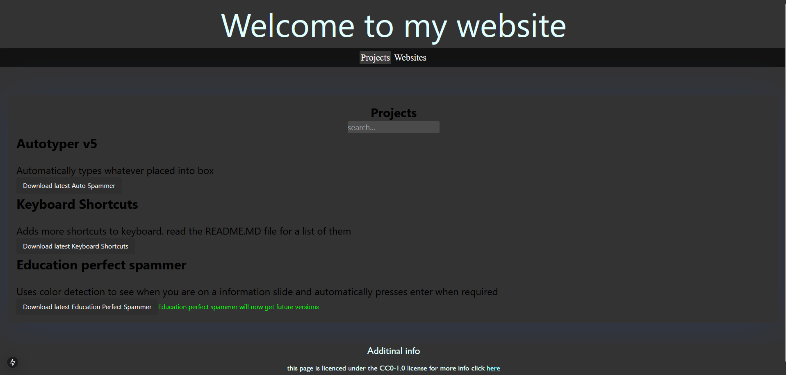
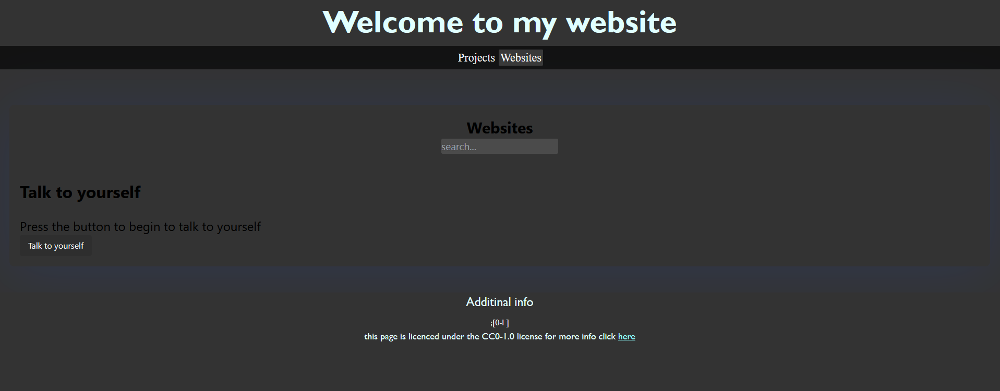

# Main Website

what is this?
---
This is a nextjs web app designed to replace the legacy version of [chickenmuggets.github.io](chickenmuggets.github.io) 

what is the difference from the legacy version?
---
the difference is that the legacy version was written in plain html,css, and javascript while this version is written in react with the [next js framework](https://nextjs.org/) 

 
When will it be finished?
---
It is finished now however it will be reciving new features and should have the full featureset of the legacy website by the 16th of February 

Why is it being changed
---
it is being changed because the original website was outdated and several downloads as well as links didn't work

Can I access the old website
---
Yes, you can find the old website [here](https://chickenmuggets.github.io/Legacy)
